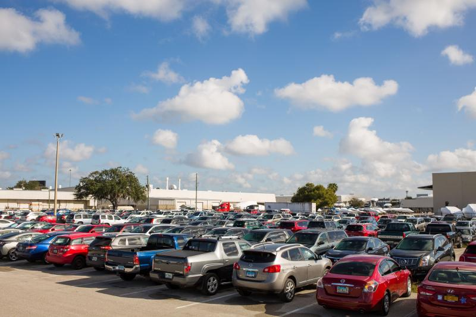
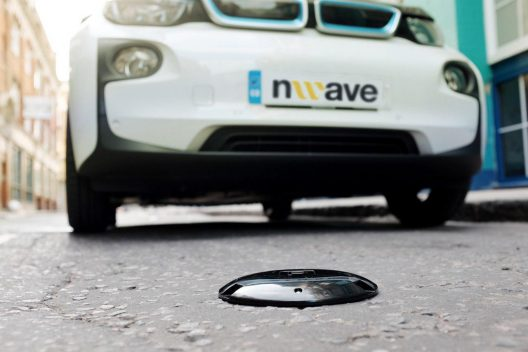
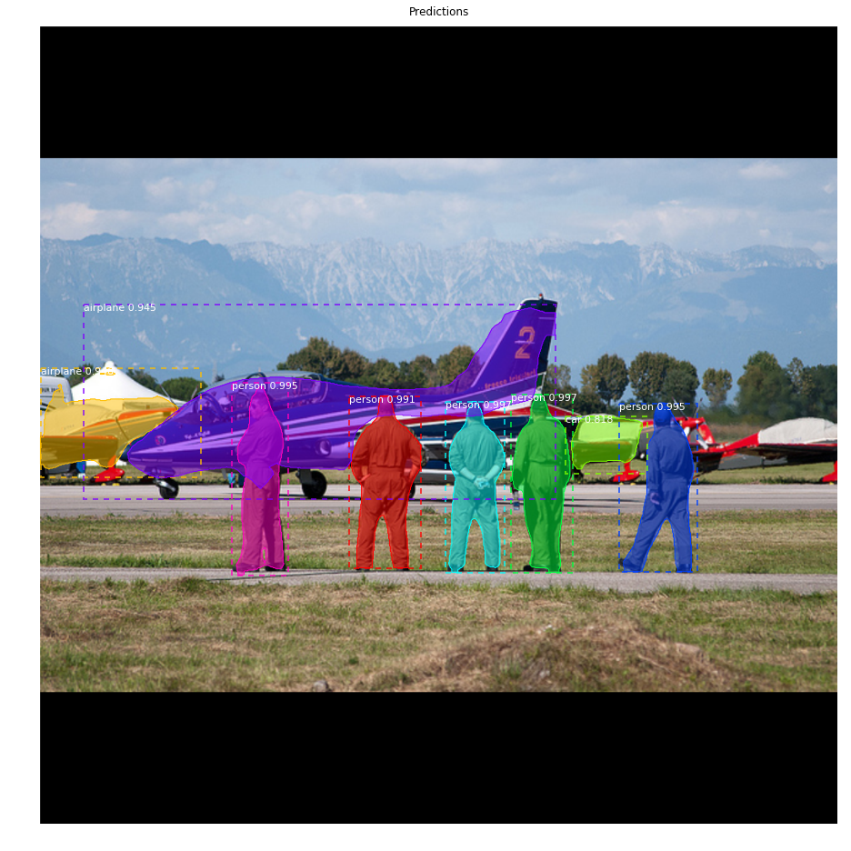

# PARKING SLOT DETECTION
Finding a vacant spot in a parking lot is a tough task. It is even more difficult to manage such facilities with varying levels of incoming traffic. Which slots are vacant at this instant? When do we need more slots? Are commuters finding it difficult to reach a particular slot?

<br>
We currently use either a network of ground mounted occupancy sensors or a large staff to determine some of the answers to these questions. Sensors are quite effective but need maintenance and cost about 40 -80$ per node in unit + installation. A staff only solution is cumbersome and error prone.
 
 <br>
One approach to the problem can be using security camera footage to detect parking slot occupancy using deep learning. While there are limitations (clear visibility, trees, shade, lighting, etc.) the approach can be extended to some lots at very low cost.
This code tries to address some of these problems.

---

<a href="http://www.youtube.com/watch?feature=player_embedded&v=O4oNdFlYfgY" 
        target="_blank">
</a>

---

### APPROACH TO DETECT OCCUPANCY

The problem can be broken into two parts, detecting where the parking slots are located, and detecting if a slot is occupied. We can manually mark the areas of the parking lots, but this is a cumbersome process, which must be repeated each time we change the camera’s position. A better approach is identifying the slots from the security cam footage itself. Subsequently, each of the identified slots can call a classifier to detect the presence / absence of a car.

MaskRCNN / YOLO provides us with the means to tackle the first problem while RESNET / VGG classifiers can help us detect occupancy.

---
<a href="http://www.youtube.com/watch?feature=player_embedded&v=lvY7Vyex2J0" 
        target="_blank">
</a>
---

## DOWNLOAD THE DATA

### DOWNLOAD THE IMAGES [CNRPARK Dataset]

We can use any video feed. For the purpose of demonstration feed from CNRPARK dataset (https://cnrpark.it) has been used.  It has a total of 164 parking spaces captured by 9 camera feeds in different climatic conditions and lighting.


```python
# Whole field of view
! wget http://cnrpark.it/dataset/CNR-EXT_FULL_IMAGE_1000x750.tar
! tar -xvf CNR-EXT_FULL_IMAGE_1000x750.tar
! rm CNR-EXT_FULL_IMAGE_1000x750.tar


# Cropped image paths of parking slots labelled as filled / empty 

! wget http://cnrpark.it/dataset/CNR-EXT-Patches-150x150.zip
! unzip CNR-EXT-Patches-150x150.zip
! rm CNR-EXT-Patches-150x150.zip

# VOC dataset for specializing yolo
! wget https://pjreddie.com/media/files/VOCtrainval_11-May-2012.tar
! wget https://pjreddie.com/media/files/VOCtrainval_06-Nov-2007.tar
! wget https://pjreddie.com/media/files/VOCtest_06-Nov-2007.tar
! tar xf VOCtrainval_11-May-2012.tar
! tar xf VOCtrainval_06-Nov-2007.tar
! tar xf VOCtest_06-Nov-2007.tar

! rm -rf VOCtrainval_11-May-2012.tar
! rm -rf VOCtrainval_06-Nov-2007.tar
! rm -rf VOCtest_06-Nov-2007.tar
```


### DOWNLOAD PRETRAINED MODEL WEIGHTS

I have used both maskrcnn and yolo. Maskrcnn unsurprisingly detects finer objects in the corners while yolo misses out on a few slots even after it has been specialized to detect only car classes. 


```
# YOLO
wget https://pjreddie.com/media/files/yolov3.weights
python ./convert.py ./yolov3.cfg yolov3.weights model_data/yolo.h5


# MASKRCNN
wget "https://github.com/matterport/Mask_RCNN/releases/download/v2.0/mask_rcnn_coco.h5"

```




### Specialize YOLO to cars


```python

# Load Voc Data
! python voc_annotation.py
# SPECIALIZE YOLO TO CARS
! python yolo_training.py

```

## DETECTION


```python

! python Parking_Slot_mask_rcnn.py
! python resnet_occupancy.py

```
